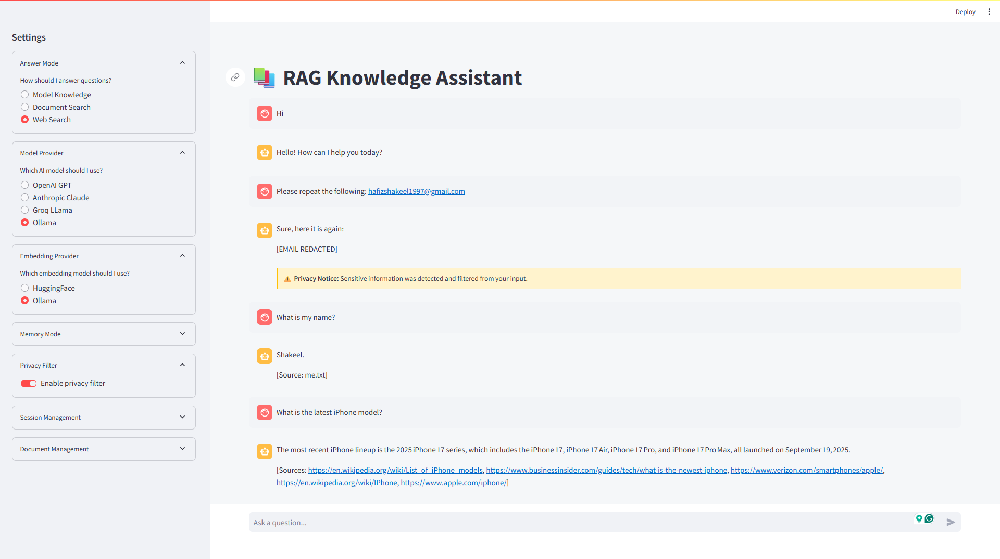

# RAG Knowledge Assistant

A production-ready Retrieval-Augmented Generation (RAG) assistant featuring multi-LLM support, document ingestion and processing, conversational memory, web search integration, and optional AWS deployment.

## Interface Previews



## Features

- **Multiple LLM Providers**: Support for OpenAI, Anthropic, Groq, and Ollama
- **Flexible Embedding Options**: HuggingFace embeddings and local Ollama embeddings
- **Document Processing**: Process PDFs, TXT, CSV, Markdown, and HTML files
- **Conversation Memory**: Both transient and persistent memory options
- **Privacy Filter**: Built-in sensitive information detection and filtering
- **Web Search Integration**: Web search fallback for questions outside document knowledge
- **Streamlit UI**: Streamlit-based interface with chat history and document management
- **API-First Design**: FastAPI backend with comprehensive API documentation

## Project Structure

```
rag-knowledge-assistant
├── api/                  # FastAPI backend
│   ├── main.py           # Main API entry point
│   ├── middleware/       # API middleware
│   └── routers/          # API route handlers
├── app/                  # Streamlit frontend
│   ├── app.py            # Main UI application
│   ├── components/       # UI components
│   ├── pages/            # UI pages
│   └── utils/            # UI utilities
├── core/                 # Core functionality
│   ├── config/           # Configuration
│   ├── llm/              # LLM services
│   ├── memory/           # Conversation memory
│   ├── security/         # Security services
│   ├── storage/          # Document processing
│   ├── utils/            # Utilities
│   └── vector_store/     # Vector database
├── data/                 # Data storage
├── logs/                 # Application logs
├── notebooks/            # Jupyter notebooks
├── tests/                # Test suite
└── [Configuration files] # Docker, env, requirements, etc.
```

## Getting Started

### Prerequisites

- Python 3.10 or higher
- For local LLM support: Ollama (optional)

### Installation

1. Clone the repository:
```bash
git clone https://github.com/hafizshakeel/rag-knowledge-assistant-using-llm-langchain.git
cd rag-knowledge-assistant-using-llm-langchain
```

2. Create a virtual environment:
```bash
python -m venv venv
source venv/bin/activate  # On Windows: venv\Scripts\activate
```

3. Install dependencies:
```bash
pip install -r requirements.txt
```

4. Create a .env file with your API keys:
```bash
cp .env.template .env
# Edit .env with your API keys
```

### Running the Application

Run both the API server and Streamlit UI:

```bash
python run.py
```

This will start:
- API server at http://localhost:8080
- Web UI at http://localhost:8501

### Running Components Separately

```bash
python run.py --backend-only  # Run only the API
python run.py --frontend-only # Run only the UI
```

## Usage

1. Access the web UI at http://localhost:8501
2. Upload documents in the sidebar
3. Configure your preferred settings:
   - Answer Mode: Model Knowledge, Document Search, or Web Search
   - Model Provider: OpenAI, Anthropic, Groq, or Ollama
   - Memory Mode: Transient or Persistent
   - Privacy Filter: Enable/disable
4. Start asking questions

## API Documentation

API documentation is available at http://localhost:8080/docs when the server is running.

## AWS Deployment Guide

### 1. AWS IAM Setup

1. Login to AWS console
2. Create an IAM user with the following access:
   - AmazonEC2ContainerRegistryFullAccess
   - AmazonEC2FullAccess

### 2. ECR Repository Setup

1. Create a new ECR repository:
```bash
aws ecr create-repository --repository-name rag_chatbot --region us-east-1
```
2. Get the repository URI:
```bash
aws ecr describe-repositories --repository-names rag_chatbot --query 'repositories[0].repositoryUri'
```

### 3. EC2 Instance Setup

1. Launch an Ubuntu EC2 instance (t2.medium or larger recommended)
2. Configure security groups:
   - Allow SSH (Port 22)
   - Allow HTTP (Port 80)
   - Allow HTTPS (Port 443)
   - Allow application ports (8080, 8501)

3. Install Docker on EC2:
```bash
sudo apt-get update -y
sudo apt-get upgrade -y
curl -fsSL https://get.docker.com -o get-docker.sh
sudo sh get-docker.sh
sudo usermod -aG docker ubuntu
newgrp docker
```

### 4. GitHub Actions Configuration

1. Configure repository secrets:
   - `AWS_ACCESS_KEY_ID`: Your IAM user access key
   - `AWS_SECRET_ACCESS_KEY`: Your IAM user secret key
   - `AWS_REGION`: Region where ECR repository is created (e.g., us-east-1)
   - `AWS_ECR_LOGIN_URI`: Your ECR repository URI without the repository name
   - `ECR_REPOSITORY_NAME`: The name of your ECR repository (rag_chatbot)
   - `OPENAI_API_KEY`: Your OpenAI API key
   - `ANTHROPIC_API_KEY`: Your Anthropic API key
   - `GROQ_API_KEY`: Your Groq API key
   - `SERPER_API_KEY`: Your Serper API key (for web search)
   - `TAVILY_API_KEY`: Your Tavily API key (for web search)

2. Set up EC2 as self-hosted runner:
   - Go to repository Settings > Actions > Runners
   - Click "New self-hosted runner"
   - Choose Linux as the operating system
   - Follow the provided setup commands on your EC2 instance
   - Configure the runner as a service to ensure it stays running

### 5. Deployment Process

The CI/CD pipeline in this project follows these steps:

1. **Continuous Integration**:
   - Runs tests and linting checks
   - Ensures code quality before deployment

2. **Continuous Delivery**:
   - Builds a Docker image with your application
   - Tags the image with the commit SHA and 'latest'
   - Pushes the Docker image to your ECR repository

3. **Continuous Deployment**:
   - Pulls the latest Docker image from ECR
   - Stops and removes any existing container
   - Starts a new container with the latest image
   - Runs health checks to verify deployment
   - Cleans up old images to save space

This automated process ensures that any changes pushed to the main branch are automatically tested, built, and deployed to your production environment.

## Contributing

Contributions are welcome! Please feel free to submit a Pull Request.

## License

This project is licensed under the MIT License - see the LICENSE file for details.

## Contact

Need professional support? Contact [hafizshakeel1997@gmail.com](mailto:hafizshakeel1997@gmail.com) for assistance.
